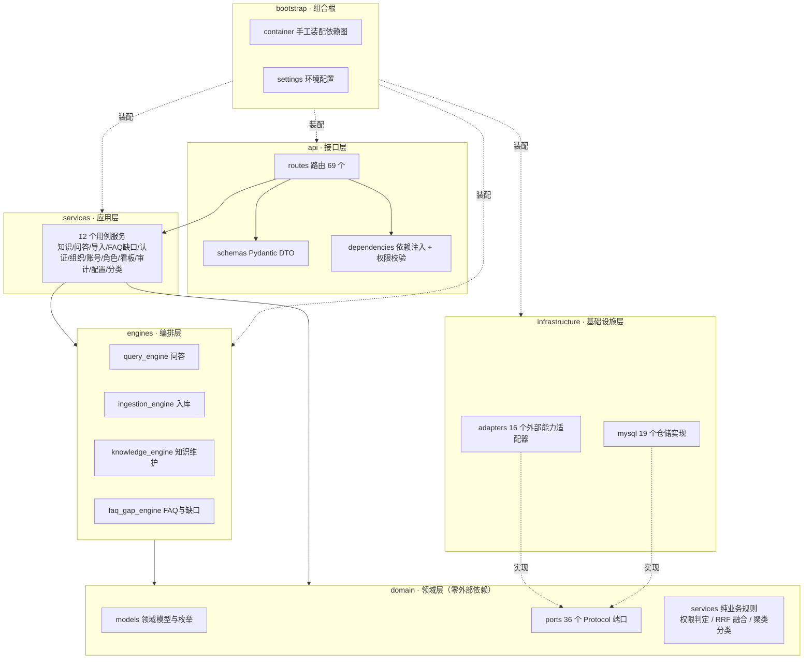
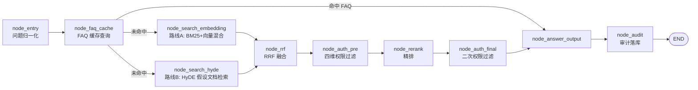
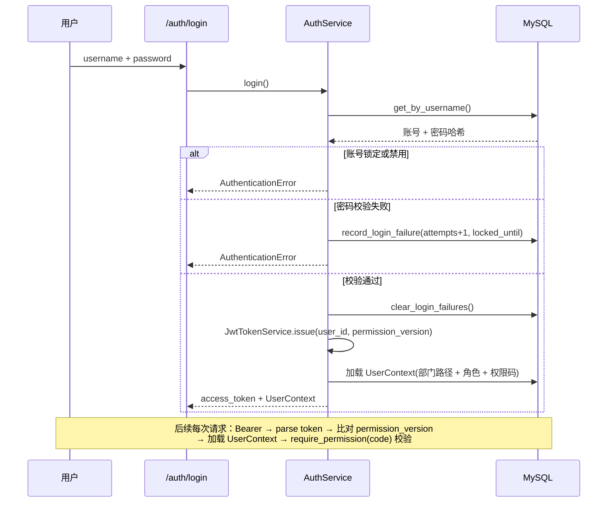
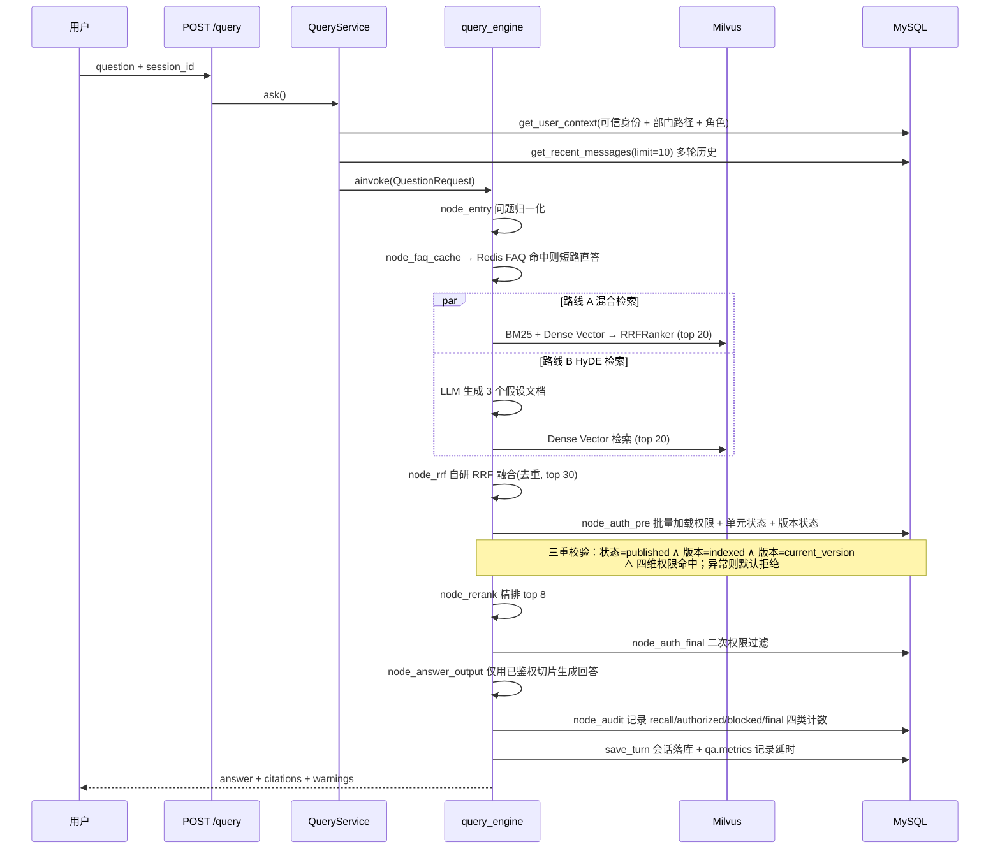

# 知识库管理平台 · 后端项目总结

> 阅读范围：`backend/` 全量源码（170 个 `.py`，有效代码约 12,900 行）、9 个数据库迁移脚本、9 个测试文件、`compose.yaml` / `Dockerfile.app` 容器编排，以及根目录需求文档。
>
> 文档定位：面向开发、测试与运维的项目全景说明，覆盖架构、技术栈、业务流程与待优化点。

---

## 1. 项目概览

### 1.1 项目定位

后端为「知识库管理平台」的业务与检索服务层，目标是把五件事收敛到一套鉴权体系之内：

| 能力域 | 说明 |
| --- | --- |
| 知识多源维护 | 多格式文档解析、切片、向量化索引、知识单元与版本生命周期管理 |
| 四维细粒度数据权限 | 全局 / 部门 / 角色 / 个人四类权限实体，OR 逻辑判定，默认拒绝 |
| AI 鉴权检索问答 | 混合检索 + 权限裁剪 + 引用溯源 + 流式输出，越权内容不外泄 |
| 运营数据看板 | PV/UV、知识总量、高频问题榜、热门知识榜、Token 与延时趋势 |
| 知识自动沉淀 | 问答日志聚类挖 FAQ、缺口识别、审核发布、缓存加速应答 |

### 1.2 关键规模指标

| 指标 | 数值 |
| --- | --- |
| Python 源码文件 | 170 个（有效代码约 12,900 行） |
| HTTP 接口 | 69 个，统一前缀 `/api/v1` |
| LangGraph 工作流 | 4 条（问答 / 入库 / 知识维护 / FAQ 与缺口） |
| 数据库物理表 | 24 张（MySQL 8.0） |
| 领域端口（Protocol） | 36 个，全部在 `domain/ports.py` 声明 |
| 后台任务类型 | 3 类（文档入库、FAQ 挖掘、缺口检测） |
| 测试代码量 | 1,387 行 / 9 个测试文件 |

---

## 2. 项目架构

### 2.1 总体分层与依赖方向

后端是标准的**六边形（端口—适配器）分层架构**，依赖方向严格单向：外层依赖内层，内层不感知任何框架。



依赖规则（`backend/README.md` 明确约定）：

```
api -> services -> engines -> domain
infrastructure -> implements domain ports
bootstrap -> composition root
```

`domain/` 目录不引入 FastAPI、SQLAlchemy、pymilvus 或任何模型 SDK，因此权限判定、RRF 融合、问题聚类这些核心规则可以脱离数据库与外部服务被单元测试直接覆盖（`tests/test_phase_a_contracts.py`、`tests/test_faq_gap_engine.py` 即为此类测试）。

### 2.2 各层职责与关键文件

| 层 | 目录 | 职责 | 代表文件 |
| --- | --- | --- | --- |
| 接口层 | `api/routes` (13 个) | HTTP 路由、请求校验、SSE 输出 | `knowledge.py`(16 端点)、`faq_gap.py`(10) |
| | `api/schemas` (9 个) | Pydantic 请求/响应 DTO，含 `from_domain()` 转换 | `knowledge.py`、`iam.py` |
| | `api/dependencies.py` | 容器注入、`get_current_user`、`require_permission()` 权限码依赖工厂 | 179 行 |
| 应用层 | `services` (12 个) | 用例编排：鉴权前置、调用工作流、落库、审计 | `knowledge_service.py`(307 行) |
| 编排层 | `engines/*/main_graph.py` | 构建 `StateGraph`、注册节点、声明条件边 | 4 个主图 |
| | `engines/*/nodes/` | 单职责节点，继承 `*NodeBase` 统一异常处理 | 共 33 个节点 |
| 领域层 | `domain/models.py` | 596 行，`frozen dataclass` + `StrEnum` 领域模型 | 含 20+ 枚举 |
| | `domain/ports.py` | 572 行，36 个 `Protocol` 端口声明 | 全部外部能力入口 |
| | `domain/services/` | 纯规则：`PermissionPolicy` / `RrfFuser` / 聚类分类 | 无 IO |
| 基础设施层 | `adapters/` (16 个) | MinIO、Milvus、MinerU、VLM、LLM、Reranker、Redis、JWT、Scrypt | `milvus_utils.py`(298 行) |
| | `mysql/` (19 个) | 各聚合根仓储实现，统一 `async_sessionmaker` | `faq_repository.py`(286 行) |
| 组合根 | `bootstrap/container.py` | 单文件手工装配全部依赖（333 行） | 唯一装配点 |
| 后台 | `workers/` (6 个) | MySQL 任务表 Worker + 周期调度器 + 3 个处理器 | `mysql_worker.py` |

### 2.3 请求装配与横切关注点

`api/app.py` 的 `ApplicationFactory.create()` 承担应用装配，包含四个可复用的横切能力：

**1）生命周期与容器**

```python
@asynccontextmanager
async def lifespan(app):
    container = build_container(settings)   # 启动时构建组合根
    app.state.container = container
    try:
        yield
    finally:
        await container.close()             # 关闭 MySQL 连接池与 Redis
```

**2）链路追踪**：`X-Request-ID` 中间件为每个请求生成或透传 request ID，写入 `request.state` 并回写响应头；所有业务异常响应都会带上该 ID。

**3）统一异常映射**（错误码稳定，前端可依赖）

| 异常 | HTTP | 错误码 |
| --- | --- | --- |
| `ValidationError` | 422 | `VALIDATION_ERROR` |
| `AuthenticationError` | 401 | `AUTHENTICATION_FAILED` |
| `AuthorizationError` / `PermissionError` | 403 | `AUTHORIZATION_DENIED` |
| `NotFoundError` / `LookupError` | 404 | `RESOURCE_NOT_FOUND` |
| `ConflictError` / `IntegrityError` | 409 | `RESOURCE_CONFLICT` |
| `DependencyUnavailableError` / `SQLAlchemyError` | 503 | `DEPENDENCY_UNAVAILABLE` |

响应体统一为 `{code, message, details, request_id}`。

**4）前后端一体部署**：若存在 `static/` 目录，则挂载 `/assets` 静态资源，并对非 `api/` 前缀路径做 SPA fallback 到 `index.html`，实现单体镜像直接托管 Vue 产物。

### 2.4 引擎化编排：四条 LangGraph 工作流

这是本项目架构上最有辨识度的设计——**把长链路业务（问答、入库、维护、沉淀）建模为可组合的状态图**，而非堆在 Service 里的过程式代码。四个引擎共享同一套骨架：`StateGraph(State)` → 注册节点 → 声明条件边 → 懒加载 `compile()` → `ainvoke(initial_state)`。

**① 问答引擎 `query_engine`（10 节点，含并行分支）**



要点：FAQ 命中走**短路直答**（毫秒级，跳过大模型）；未命中则以 `list[str]` 返回值触发**两路并行检索**；鉴权执行两次——RRF 融合后过滤一次（减少精排开销），精排后再过滤一次（防止精排引入越权候选），且异常时**默认拒绝**（`authorization_unavailable_default_deny`）。

**② 入库引擎 `ingestion_engine`（8 节点，纯串行）**

```
node_entry → node_mineru_parse → node_vlm_summary → node_document_split
          → node_embedding → node_milvus_import → node_index_version → node_import_audit
```

MinerU 解析 → 图片 VLM 摘要 → Markdown 切片 → 批量向量化 → Milvus 写入 → 版本置为 indexed → 审计。

**③ 知识维护引擎 `knowledge_engine`（9 节点，按动作路由）**

以 `KnowledgeAction` 枚举为路由键，一个图承载 7 种维护动作：

| 动作 | 路由目标 | 后置 |
| --- | --- | --- |
| `CREATE` | 直接进审计（由 Service 补默认权限） | |
| `UPDATE_METADATA` | `node_update_metadata` | → 审计 |
| `CREATE_VERSION` | `node_create_version`（同时入队入库任务） | → 审计 |
| `CONFIGURE_PERMISSIONS` | `node_validate_permissions` → `node_save_permissions` | → 审计 |
| `PUBLISH` / `DISABLE` / `ARCHIVE` | `node_publish` / `node_disable` | → 审计 |

**④ FAQ 与缺口引擎 `faq_gap_engine`（8 节点，二次条件路由）**

```
node_entry ─┬─ mine_faq ────→ node_load_logs ─→ node_mine_faq ───┐
            ├─ detect_gaps ─→ node_load_logs ─→ node_detect_gaps ┤
            ├─ review_faq ────────────────────→ node_review_faq ──┼→ node_audit → END
            ├─ convert_gap ──────────────────→ node_convert_gap ─┤
            └─ resolve_gap ──────────────────→ node_resolve_gap ─┘
```

**节点基类统一骨架**（`engines/*/base.py`）：每个节点继承 `*NodeBase`，实现 `async def process(self, state) -> dict[str, Any]`，只返回**状态增量**而非完整状态，由 LangGraph 负责合并，天然支持并行分支不互相覆盖。

### 2.5 后台任务与调度：不依赖 Celery / RabbitMQ

项目刻意选择**「MySQL 任务表 + 轮询 Worker + 内置调度器」**作为异步方案，减少中间件依赖。核心实现要点：

| 机制 | 实现 |
| --- | --- |
| 任务去重 | `idempotency_key` 唯一约束，重复入队直接返回既有 `job_id` |
| 并发领取安全 | `SELECT ... FOR UPDATE SKIP LOCKED` + `LIMIT batch_size`，多 Worker 不重复领取 |
| 优先级 | `ORDER BY priority DESC, run_at ASC` |
| 心跳与回收 | `release_stale(timeout)` 将心跳超时的 `RUNNING` 任务重置为 `PENDING` |
| 失败重试 | 指数退避 `run_at = now + 2^attempts`，`attempts >= max_attempts` 时终态 `FAILED` |
| 进度上报 | `update_progress(job_id, stage, progress)`，阶段枚举 `JOB_STAGE` 驱动前端进度条 |
| 周期调度 | `MysqlJobScheduler` 以 `scheduled:{schedule_id}:{时间片}` 作为幂等键，同一周期只投递一次 |

**三类任务**与处理器（`workers/main.py`）：

| 任务类型 | 处理器 | 触发方式 |
| --- | --- | --- |
| `ingest_document` | `IngestionJobHandler` | 文件上传 / 创建版本时入队 |
| `faq_mining` | `FaqMiningJobHandler` | 调度器周期投递（默认 86400s） |
| `gap_detection` | `GapDetectionJobHandler` | 调度器周期投递（默认 86400s） |

Worker 进程通过 `asyncio.TaskGroup` 并发运行「消费者」与「调度器」两个协程，任一异常即整体退出并释放容器资源。

### 2.6 部署拓扑

`compose.yaml` 定义了完整的本地/单机生产拓扑，共 10 个服务，依赖关系由 healthcheck 编排：

```
mysql (8.0.40) ──→ db-init（顺序执行 migrations/*.sql）──→ seed（幂等初始化管理员与演示数据）
                                                            │
redis (7.4.2)  ─────────────────────────────────────────────┤
minio ──→ minio-init（建桶 + 关闭匿名访问）─────────────────┤
etcd ──→ milvus (v2.5.4 standalone) ──→ attu (可视化) ───────┤
                                                            ↓
                                          backend（含静态前端产物）
                                          worker（同镜像，不同入口命令）
```

- 前端在 `Dockerfile.app` 的多阶段构建中用 `node:22-alpine` 编译，产物拷入 `static/`，由 FastAPI 直接托管。
- 应用镜像基于 `python:3.12-slim`，用 `uv sync --frozen` 安装依赖，并单独装 `sentence-transformers`（CPU 版 torch）以支持本地 BGE-M3。
- 后端与 Worker 共享同一镜像、同一 `.env`，仅启动命令不同（`uvicorn ...` 与 `python -m kb_manage_platform.workers.main`）。

---

## 3. 项目技术栈

### 3.1 后端核心

| 分类 | 选型 | 版本约束 | 用途 |
| --- | --- | --- | --- |
| 语言 | Python | `>=3.11`（镜像用 3.12） | 全面使用 `StrEnum`、`dataclass(slots=True)`、`zip(strict=True)` 等 3.10+ 特性 |
| Web 框架 | FastAPI | `>=0.115.0` | 路由、依赖注入、OpenAPI |
| ASGI 服务器 | Uvicorn[standard] | `>=0.30.0` | 运行时 |
| 配置管理 | pydantic-settings | `>=2.7.0` | `.env` + 环境变量，`Settings` 单一配置对象 |
| 工作流编排 | **LangGraph** | `>=0.2.0` | 4 条业务状态图 |
| LLM 客户端 | langchain-openai | `>=0.3.0` | `ChatOpenAI` 兼容 OpenAI 协议，用于 HyDE 与回答生成 |
| HTTP 客户端 | httpx | `>=0.27.0` | MinerU / VLM / Reranker / Embedding 远程调用 + 模型连通性测试 |
| 定时任务 | 自研 MySQL 调度器 | — | 见 2.5，刻意不用 Celery/RabbitMQ |

### 3.2 存储与中间件

| 组件 | 选型 | 用途 | 对应适配器 |
| --- | --- | --- | --- |
| 关系库 | MySQL 8.0.40 + SQLAlchemy 2.0(async) + aiomysql | 元数据、IAM、会话、审计、任务队列 | `infrastructure/mysql/*` |
| 缓存 | Redis 7.4.2 (`redis>=5.2.0`) | FAQ 应答缓存、权限版本号、锁 | `cache_utils.py`、`permission_version_utils.py` |
| 对象存储 | MinIO (`minio>=7.2.0`) | 原始文档、Markdown、图片三桶 | `storage_utils.py` |
| 向量库 | Milvus 2.5.4 (`pymilvus>=2.5.7`) + etcd | Dense Vector + BM25 稀疏向量，原生混合检索 | `milvus_utils.py`、`retrieval_utils.py` |
| 可视化 | Attu v2.5.0 | Milvus 控制台（8088 端口） | — |

### 3.3 AI 与检索栈

| 环节 | 实现 | 配置项 |
| --- | --- | --- |
| 文档解析 | 线上 MinerU API（PDF/Word → Markdown + 图片） | `MINERU_*`，超时 600s，单文件上限 100MB |
| 图片理解 | OpenAI 兼容 VLM，产出 OCR/描述/实体/摘要，回写切片 | `VLM_*`，置信度阈值 0.75，prompt 版本 `v1` |
| 向量化 | 本地 `BAAI/bge-m3`（优先）或远程 OpenAI 兼容接口 | `BGE_M3_PATH` / `EMBEDDING_*`，维度 1024 |
| 混合检索（路线 A） | Milvus 原生 BM25 + Dense Vector → `RRFRanker` | `HYBRID_TOP_K=20` |
| HyDE 检索（路线 B） | LLM 生成 3 个假设文档 → 向量检索去重 | `LLM_HYDE_COUNT=3`，`HYDE_TOP_K=20` |
| 双路融合 | 自研 `RrfFuser`，`score += 1/(k + rank)`，按 `chunk_id` 去重 | `RRF_K=60` |
| 精排 | Reranker（支持 `/rerank` 与 `/services/rerank/` 两种端点风格） | `RERANKER_TOP_N=30` → `RERANKER_TOP_K=8` |
| 答案生成 | LangChain `ChatOpenAI`，仅拼接**已鉴权**切片 | `LLM_DEFAULT_MODEL`、温度 0.1、max_tokens 2048 |
| 降级策略 | LLM 异常时回退「抽取式回答」：按中文二元组重合度排序取 Top-4 原文 | `node_answer_output.py` |

### 3.4 安全与工程化

| 分类 | 选型 | 说明 |
| --- | --- | --- |
| 密码哈希 | `hashlib.scrypt` 自研 `ScryptPasswordHasher` | 不引入 passlib |
| 令牌 | 自研 `JwtTokenService`（HS256 + issuer + 权限版本号） | `JWT_EXPIRES_SECONDS=28800` |
| 密钥加密 | `LocalSecretCipher`（基于 JWT 密钥派生） | 模型 API Key 落库加密，出参掩码 |
| 登录防爆破 | 失败计数 + 锁定 | 阈值 5 次，锁定 900s |
| 静态检查 | ruff（`E,F,I,UP,B`，行宽 100） | `pyproject.toml` |
| 类型检查 | mypy（配置项存在）、12 处 `# type: ignore` | 集中在工作流→仓储的 Protocol 边界 |
| 测试 | pytest + pytest-asyncio + StrictMode | 9 个测试文件，1,387 行 |
| 依赖管理 | uv（`uv.lock` 764KB，含完整哈希锁） | `uv sync --frozen` |
| 迁移 | 裸 SQL（9 个）+ `schema_check` 启动校验 | alembic 已声明但未启用（见 §7） |

### 3.5 协作侧前端（供上下文参考）

Vue 3.5 + TypeScript 5.7 + Vite 6 + Element Plus 2.9 + ECharts 6 + pdfjs-dist（PDF 预览）+ vue-router 4。后端已为前端提供 69 个接口与 SSE 流式端点，`docs/frontend-button-api-mapping.md` 维护按钮级映射。

---

## 4. 数据模型

24 张表按业务域划分（迁移脚本 `migrations/001~009_*.sql`）：

| 业务域 | 表 | 说明 |
| --- | --- | --- |
| **知识主数据** | `knowledge_unit` | 知识单元聚合根：标题、分类、标签、状态、当前版本 |
| | `knowledge_version` | 版本文档：版本号、源对象键、Markdown 键、状态 |
| | `knowledge_permission` | 四维权限规则：`scope`(global/department/role/user) + `subject_id` + `include_descendants` |
| | `knowledge_category` | 分类字典：名称、描述、排序、状态 |
| **IAM** | `iam_department` | 部门树：`parent_id` + `path`（物化路径，用于祖孙判定） |
| | `iam_user` | 账号：用户名、部门、状态、`permission_version`、失败次数、锁定时间 |
| | `iam_role` / `iam_user_role` / `iam_role_permission` | 角色、用户—角色、角色—操作权限三级关联 |
| | `iam_permission` | 操作权限定义表（`knowledge:read` 等） |
| **问答** | `qa_session` / `qa_message` / `qa_citation` | 会话、消息、引用溯源（关联 `knowledge_id`） |
| | `qa_audit` | 统一审计流水（`event_type` + JSON payload），同时支撑看板与 FAQ 挖掘 |
| **FAQ 沉淀** | `knowledge_faq` / `knowledge_faq_permission` | 已发布 FAQ + 独立权限（FAQ 可脱离原知识单元单独授权） |
| | `knowledge_faq_candidate` / `..._source` | 候选 FAQ 及其来源问答记录 |
| **知识缺口** | `knowledge_gap` / `knowledge_gap_source` | 缺口聚合记录 + 来源问答 |
| | `knowledge_supplement_draft` | 缺口转建的知识补充草稿 |
| **配置与任务** | `model_config` | 模型配置（`api_key_ciphertext` 加密存储） |
| | `system_setting` | 系统参数覆盖值 |
| | `background_job` | 任务队列：`idempotency_key`、`priority`、`run_at`、`locked_by`、`heartbeat_at`、`attempts`、`max_attempts`、`stage`、`progress` |

**设计亮点**：

1. **领域模型与 ORM 模型彻底分离**——`domain/models.py` 用 `frozen dataclass`，`infrastructure/mysql/models.py` 用 SQLAlchemy `Mapped`，仓储负责双向转换（`_to_record()` / `_to_model()`）。领域层因此可零依赖测试。
2. **审计表复用**——`qa_audit` 一个表承载 `qa.completed`（FAQ/缺口挖掘输入）、`qa.metrics`（Token/延时）、`model.configured`、`model.tested` 等多类事件，看板与挖掘都从它读数据，避免多套埋点。
3. **权限版本号 `permission_version`**——用户与令牌双向持有，权限变更时递增即可让存量令牌失效，是「即时生效」的实现基础。
4. **物化路径部门树**——`path` 形如 `dept-root/dept-hr`，`include_descendants` 判定只需一次字符串包含判断，无需递归查询。

---

## 5. 项目业务流程

### 5.1 认证与鉴权流程



**两级鉴权**清晰分工：

- **操作权限（RBAC）**：`require_permission("knowledge:publish")` 依赖工厂，校验 `user.permission_codes`，覆盖 18 个权限码（`knowledge:*`、`import:*`、`qa:*`、`dashboard:read`、`audit:*`、`model:manage`、`system:manage`、`faq:manage`、`gap:manage`）。
- **数据权限（四维）**：`PermissionPolicy.matches()` 在领域层实现，OR 逻辑——命中全局 / 直属部门 / 含子孙部门 / 所属角色 / 本人任一即放行；`is_active=False` 一律拒绝。

### 5.2 知识维护与权限配置流程

对应需求 2.9.7 第 1 条，落在 `knowledge_engine`：

1. 知识管理员调用 `POST /knowledge` 创建草稿 → 工作流 `CREATE` 动作 → **Service 自动写入一条 `(user, 创建者本人)` 权限**（默认不公开，符合「默认无任何公开访问权限」要求）。
2. 上传文档：`POST /knowledge/{id}/versions/upload` → 文件写入 MinIO `raw` 桶 → 工作流 `CREATE_VERSION` → **同时入队 `ingest_document` 任务** → 返回 `job_id`，前端轮询进度。
3. 配置权限：`PUT /knowledge/{id}/permissions` → `node_validate_permissions`（`PermissionPolicy.normalize()` 去重、校验非全局规则必须有 `subject_id`）→ `node_save_permissions`（`replace_grants` 整体替换 + `PermissionVersionStore.invalidate()` 递增版本并使缓存失效）。
4. 发布：`POST /knowledge/{id}/publish` → 状态置 `published` → **并联动 `gap_repository.resolve_by_knowledge()` 自动关闭关联知识缺口**。

### 5.3 文档解析与索引流程

`POST /import/files` 或 `POST /knowledge/{id}/versions/upload` 后，Worker 侧执行 8 节点串行链路：

```
① MinIO 落盘    后缀白名单校验（pdf/doc/docx/md/markdown/txt）→ 对象键 knowledge/{kid}/{vid}/{uuid}-{name}
② MinerU 解析   轮询线上 API（超时 600s）→ 产出 Markdown + 图片清单，写入 markdown 桶
③ VLM 摘要      逐图调用 OpenAI 兼容 VLM → 摘要/置信度写入切片
④ 切片          BasicChunker：按 Markdown 结构 + 图片摘要切分
⑤ 向量化        ModelEmbedder 批量嵌入（batch=32），本地 BGE-M3 或远程接口
⑥ Milvus 写入   upsert 切片 + dense_vector，BM25 稀疏向量由 Milvus Function 自动生成
⑦ 版本置位      version.status = indexed
⑧ 审计          event_type = import.*
```

进度上报：`parsing(10%)` → `indexing(90%)` → `completed(100%)`。

### 5.4 AI 鉴权检索问答流程（核心流程）

对应需求 2.9.7 第 2 条与 2.9.4 鉴权规则，是整条链路上最复杂的部分：



**这个流程里有三个值得单独指出的工程细节：**

1. **检索与鉴权解耦**——Milvus 只负责召回，不携带任何权限过滤条件；权限在 `MysqlAuthorizationEngine` 中基于 MySQL 的 `knowledge_permission` 表判定。好处是权限变更无需重刷向量索引。
2. **鉴权做三重一致性校验**——不仅校验权限，还校验知识单元 `published` **且** 版本 `indexed` **且** 该版本是 `current_version_id`。这保证了「已停用知识」「历史版本」不会被检索命中，也解释了为什么版本回滚（`POST .../rollback`）能立即生效。
3. **权限异常时 fail-closed 降级**——`NodeAuthFilter` 捕获任何异常后返回空候选并附 warning `authorization_unavailable_default_deny`，宁可答不出、绝不越权。

**流式输出**：`POST /query/stream` 以 SSE 返回，事件序列为
`meta → warning* → delta → citation* → usage → done`，异常时返回 `error`（含 `retryable` 标志）。

### 5.5 FAQ 挖掘、审核与缓存加速流程

对应需求 2.9.7 第 3 条前半段：

1. **定期挖掘**（调度器默认 24h 投递 `faq_mining`，窗口 30 天）→ `MysqlQaLogRepository.list_logs()` 读 `qa.completed` 审计 → `QuestionClusterer` 贪心聚类（相似度阈值 0.85）→ `FaqCandidateBuilder` 过滤（出现次数 ≥ 10 且独立用户 ≥ 5）→ 写入候选表。
2. **权限签名分支**：候选的 `permission_signature == "global"` 时直接置为可发布，否则置为 `PENDING_REVIEW` 待人工审核。
3. **人工审核**：`POST /faq/review` → `approve` 走 `publish_candidate`（可同时写入 FAQ 独立权限），`reject` 走驳回并记录原因。
4. **缓存加速**：发布后 `RedisFaqCache.invalidate_question()` 清理旧缓存；后续同类提问在 `node_faq_cache` 命中 Redis 直接返回，**跳过大模型调用**（`lookup()` 未命中会回源 MySQL 并回填 Redis，Redis 故障静默降级到 MySQL）。

### 5.6 知识缺口闭环流程

1. **缺口识别**（调度器默认 24h 投递 `gap_detection`）→ `KnowledgeGapClassifier.classify()` 筛选两类日志：
   - `recall_count == 0` → 归为 `NO_CANDIDATE`（完全未命中）
   - `authorized_count > 0 ∧ final_count == 0` → 归为 `LOW_CONFIDENCE`（召回了但没通过鉴权/精排）
2. 聚类后按问题簇生成缺口记录，附带频次、涉及部门、最高相似度、建议分类（`suggested_category`，当前默认 `pending`）。
3. **转建**：`POST /gaps/{id}/convert` → 创建知识补充草稿 `knowledge_supplement_draft`，状态置 `CONVERTED`。
4. **闭环**：知识管理员补充文档并发布 → `KnowledgeService.publish()` 自动调用 `resolve_by_knowledge()` 把关联缺口置为 `RESOLVED`。

### 5.7 看板与审计流程

- **写入**：每轮问答产生两条审计——`node_audit` 的 `qa.completed`（业务维度）与 `QueryService` 的 `qa.metrics`（性能维度）。
- **读取**：`MysqlDashboardRepository.overview()` 按时间窗口 + 可选部门过滤，实时聚合 PV/UV、知识总数、已发布数、高频问题 Top、热门引用知识 Top、Token 趋势、延时趋势、FAQ 命中率、覆盖率。
- **查询与导出**：`GET /audit/logs`（分页）+ `GET /audit/export`（导出，需 `audit:export` 权限）。

---

## 6. 接口清单（69 个，前缀 `/api/v1`）

| 模块 | 前缀 | 数量 | 代表端点 |
| --- | --- | --- | --- |
| 健康检查 | `` | 1 | `GET /health` |
| 认证 | `/auth` | 4 | `POST /login`、`GET /me`、`POST /logout`、`POST /change-password` |
| 审计 | `/audit` | 2 | `GET /logs`、`GET /export` |
| 组织 | `/departments` | 5 | CRUD + `POST /{id}/status` |
| 账号 | `/users` | 5 | CRUD + `/roles` + `/password-reset` |
| 角色 | `/roles` | 6 | CRUD + `/permissions` 查询与设置 |
| 知识 | `/knowledge` | 16 | 台账、版本、上传、预览、下载、回滚、权限、发布、停用、归档 |
| 分类 | `/knowledge-categories` | 4 | CRUD |
| 系统配置 | `/system` | 5 | `/model-configs`（含 `/test` 连通性测试）、`/settings` |
| 问答 | `` | 6 | `POST /query`、`POST /query/stream`(SSE)、会话 CRUD |
| 导入 | `/import` | 4 | `POST /import`、`POST /import/files`、`GET /jobs/{id}`、`POST /jobs/{id}/retry` |
| FAQ / 缺口 | `` | 10 | `/faq/mine`、`/faq/review`、`/gaps/detect`、`/gaps/{id}/convert` |
| 看板 | `/dashboard` | 1 | `GET /overview` |

---

## 7. 项目待优化点

按「影响业务正确性 → 影响性能 → 影响可维护性」排序，每条附代码位置与建议方案。

### 7.1 高优先级（功能与需求偏差）

#### ① 「权限受限」提示未在回答中落地 ⚠️

- **现象**：需求 2.9.4 明确要求「当召回内容包含用户无权访问的知识单元时，在回答中明确标注『部分参考资料因权限受限无法展示』」。`NodeAudit` 已经统计出 `blocked_count` / `blocked_knowledge_ids` 并落库，但**回答输出环节没有消费这些数据**。
- **证据**：`engines/query_engine/nodes/node_auth_filter.py` 仅在**异常**时写入 warning；`node_answer_output.py` 只在无候选或 LLM 降级时写 warning，三种 warning 分别是 `authorization_unavailable_default_deny`、`no_authorized_context`、`llm_unavailable_extractive_fallback`——**没有权限受限类提示**。
- **影响**：验收标准第 5 条「对无权限召回项输出明确权限缺失提示」无法通过；需求 2.9.9 场景一（跨部门财务与薪酬隔离）演示效果打折。
- **建议**：在 `node_rrf` 之后（`node_auth_pre` 之前）快照候选的 `knowledge_id` 集合，与 `allowed_candidates` 求差集；若非空，则在 `NodeAnswerOutput` 中追加一条 warning（如 `partial_content_restricted`）并由 `AnswerResult.warnings` 透传到响应与 SSE `warning` 事件。

#### ② 知识台账分页在内存中完成，且存在 1000 条硬上限

- **证据**：`services/knowledge_service.py:66`
  ```python
  units, _ = await self._repository.list_units(query, status, category_id, 1, 1000)
  permission_sets = await self._permission_repository.list_grants_batch(...)
  allowed = [unit for unit in units if self._permission_policy.matches(...)]
  start = (page - 1) * page_size
  return tuple(allowed[start : start + page_size]), len(allowed)
  ```
- **问题**：三重缺陷——(a) 只取前 1000 条，**第 1001 条起的数据永久不可见**（数据正确性 bug，非纯性能问题）；(b) 每次列表请求都把 1000 条单元 + 对应权限全量加载进内存做 Python 过滤；(c) 这是唯一未在 SQL 层下推权限过滤的列表接口，其余仓储均已批量化。
- **建议**：将四维权限过滤下推为 SQL ——利用 `iam_department.path` 的物化路径做 `LIKE 'path%'` 匹配、`iam_user_role` 做角色 `IN` 匹配，与 `knowledge_permission` 左连接后用 `OR` 条件过滤，配合 `LIMIT/OFFSET` 与 `COUNT(*) OVER()` 在数据库完成分页。短期无法下推时，至少应改为游标分页 + 显式提示「已截断」。

#### ③ SSE「流式」实为一次性返回（伪流式）

- **证据**：`api/routes/query.py:45`
  ```python
  request_id, answer = await service.ask(...)   # 先等完整回答生成完
  yield _event("meta", ...)
  yield _event("delta", {"content": answer.answer})   # 只发一个 delta，整段吐出
  ```
- **影响**：前端无法实现需求要求的「流式打字机渲染」，用户感知为「长时间空白后整段出现」；长回答时首字延迟等于总生成时间，流式接口丧失了核心价值。
- **建议**：在 `AnswerGeneratorPort` 上增加 `async def stream(...) -> AsyncIterator[str]`，`LangChainAnswerGenerator` 用 `ChatOpenAI.astream()` 实现；`QueryService` 增加 `ask_stream()` 生成器版本，路由改为边生成边 `yield _event("delta", ...)`。注意 FAQ 命中、抽取式降级两条路径需按整段一次性 emit。

#### ④ 模型配置中心「存得下、用不上」

- **现象**：`ConfigurationService.save_model()` 把 LLM/Embedding/Reranker/VLM 配置（含加密 API Key）写入 `model_config` 表，`test_model()` 还能做真实连通性测试并给出「HTTP 200」——但**运行期所有适配器仍由 `container.build_container()` 从 `Settings`（`.env`）构造**：
  ```python
  hyde_generator = LangChainHydeGenerator(api_key=settings.openai_api_key, base_url=settings.openai_base_url, ...)
  answer_generator = LangChainAnswerGenerator(api_key=settings.openai_api_key, ...)
  ```
  全仓搜索确认 `MysqlModelConfigRepository` 只在 `container.py:127` 被实例化后**仅注入给 `ConfigurationService`**，检索链路从不读取。
- **影响**：管理员在界面上改模型配置、点了「测试通过」，实际问答仍走 `.env` 里的旧模型，**配置界面产生虚假的安全感**；需求 2.9.3「系统配置页维护底层模型接口配置」流于形式。
- **建议**：引入 `ModelConfigResolver`，在每次调用前（或按 TTL 缓存）解析 `model_config` 表，为空则回退环境变量；适配器改为持有 resolver 而非静态凭据。同时据此实现「不重启切换模型」。

### 7.2 中优先级（性能、健壮性、链路断点）

#### ⑤ `permission_signature` 链路断链，FAQ 自动发布分支实为死代码

- **证据链**：
  - `node_audit.py:34` 从 `item.metadata.get("permission_signature")` 取签名 → 但 `MilvusStore._OUTPUT_FIELDS` 只含 `chunk_id/knowledge_id/version_id/content/section_path/image_summary`，**该字段从未写入向量库**，因此 `signatures` **恒为空集**。
  - `faq_gap.py:79` 于是恒走 `else` 分支 → `signature = "mixed"` → `status = PENDING_REVIEW`。
  - 唯一存在 `permission_signature="global"` 的地方是 `bootstrap/sample_data.py:279`（演示数据）。
- **影响**：「全局无敏感内容的高频问题自动可发布」这条快捷通路在真实运行时永远不触发，所有 FAQ 都需要人工审核；`FaqCandidateBuilder` 中 `CANDIDATE` 与 `SensitiveContentChecker` 自动发布逻辑无法生效。
- **建议**：在切片写入 Milvus 时补写权限签名（由 `knowledge_permission` 规则归一化得到，如 `global` / `dept:xxx` / `role:xxx` / `mixed`），并在 `_OUTPUT_FIELDS` 中暴露该字段；或改为在 `node_audit` 阶段用 `knowledge_id` 反查权限聚合出签名。
- **实测验证**：手工向 `qa_audit` 写入 12 条 `permission_signatures = ["global"]` 的 `qa.completed` 日志后触发 `POST /api/v1/faq/mine`，`NodeMineFaq` 确实自动执行了 `publish_candidate`，候选状态直接由 `candidate` 变为 `published`。这证明**下游自动发布机制完好，断点确实只在上游签名写入缺失**，因此该问题的修复成本极低。

#### ⑥ 长任务执行时间与任务锁超时不匹配，存在重复执行风险

- **证据**：`mysql_worker.py:55` 每轮 `poll_once()` 都会先执行 `release_stale(lock_timeout_seconds)`；而 `lock_timeout_seconds` 默认 **300s**（`MYSQL_JOB_LOCK_TIMEOUT_SECONDS`），但 MinerU 解析超时默认 **600s**（`MINERU_TIMEOUT_SECONDS`）。任务执行期间只在开始（`parsing,10`）和结束（`indexing,90`）两处调用 `update_progress()` 刷新心跳，**中间 600 秒完全无心跳**。
- **触发条件**：Worker 副本数 > 1，或 Worker 重启后新进程立即轮询——会把正在解析的 `RUNNING` 任务判为僵尸，重置为 `PENDING` 被再次领取，导致同一文档重复解析 + 重复写入 Milvus。
- **缓解现状**：`compose.yaml` 仅定义单副本 Worker，因此当前未暴露；`release_stale` 不递增 `attempts`，但 `claim_batch` 每次领取会 `+1`，所以不会无限循环，最终会因超过 `max_attempts` 而失败。
- **建议**：实现独立心跳协程（任务执行期间每 `lock_timeout/3` 秒调 `update_progress` 或新增 `touch()` 接口）；或按任务类型设置不同的锁超时（入库任务 ≥ MinerU 超时 × 1.5）；`release_stale` 中同步递增 `attempts` 以便尽早止损。

#### ⑦ 问答链路重复鉴权，同一批权限被查两次

- **证据**：`query_engine/main_graph.py:93-95` 注册了 `node_auth_pre`（`rrf_candidates` → `allowed_candidates`）与 `node_auth_final`（`reranked_candidates` → `final_candidates`）两个节点，二者调用的是同一个 `MysqlAuthorizationEngine.filter_allowed()`，而精排**不会改变候选的 `knowledge_id` 集合**，因此第二次查询的三张表（`knowledge_permission`、`knowledge_unit`、`knowledge_version`）结果与第一次完全相同。
- **影响**：每轮问答多 3 次数据库往返。
- **建议**：保留 `node_auth_final` 作为防御性校验，但让它在 `input_key` 的 `knowledge_id ⊆ allowed_candidates 的 knowledge_id` 时直接短路复用（或给 `NodeAuthFilter` 增加可选 `cache_key` 参数实现同请求内复用）。

#### ⑧ 问题聚类基于字符相似度而非语义

- **证据**：`domain/services/faq_gap.py:55`
  ```python
  return SequenceMatcher(None, left.strip().casefold(), right.strip().casefold()).ratio()
  ```
  且 `_find_cluster()` 始终与簇内**第一条**日志比较（贪心、无簇中心更新）。
- **问题**：需求 2.9.4 要求「语义去重」，`difflib.SequenceMatcher` 是编辑距离类算法，中文短句场景下「生鲜食品破损如何申请退款」与「水果坏了怎么退钱」相似度极低，无法聚成一簇；反之句式相同但语义不同的句子可能被误聚。零依赖是该实现的优点，但它达不到需求语义。
- **建议**：改用已有的 Embedding 能力做向量聚类（余弦相似度 + 阈值或 HDBSCAN），复用 `ModelEmbedder` 与本项目已有的 Milvus 能力；若需保底无模型依赖，可退回「字符二元组 Jaccard + 阈值」，中文场景优于 `SequenceMatcher`（`node_answer_output._bigrams` 已有现成实现可复用）。

#### ⑨ Token 统计为字符数估算

- **证据**：`services/query_service.py:69`
  ```python
  estimated_tokens = max(1, int((len(question) + len(answer.answer)) / 2))
  ```
- **影响**：需求 2.9.8 要求输出「消耗 Token 数」，看板的 Token 趋势图基于此估算值，与真实计费口径存在系统性偏差（中文约 1 字 ≈ 0.6~1 token，英文偏差更大）；也未统计 Prompt 与候选切片带来的输入 Token（通常是主要成本）。
- **建议**：优先取 `ChatOpenAI` 响应中的 `usage_metadata`（prompt_tokens / completion_tokens / total_tokens）真实回传；无 usage 时退回估算，并在响应中标注 `token_source: "estimated" | "actual"`。

#### ⑩ 上传阶段缺少服务端文件体积与数量限制

- **证据**：`ImportService._SUPPORTED_SUFFIXES` 只校验**后缀**，`upload_and_submit()` 校验通过后直接 `put_bytes()` 落 MinIO；`MINERU_MAX_FILE_MB=100` 仅在**解析器内部**生效（即文件已经完整上传到 MinIO 之后才被拒绝）；批量导入无数量上限。
- **影响**：存在「上传大文件打满 MinIO / 占满请求内存」的资源耗尽风险；`content: bytes` 直接把整个文件读进内存，大文件会显著抬升进程内存。
- **建议**：路由层用 `File.size` 或 `Content-Length` 前置校验（与 `mineru_max_file_mb` 复用同一配置）；单次批量上传加数量上限（如 50 个）与总大小上限；超大文件改为流式分片写入（`UploadFile.file` 直传 MinIO）。

### 7.3 低优先级（可维护性与工程规范）

| # | 问题 | 证据 | 建议 |
| --- | --- | --- | --- |
| ⑪ | **alembic 声明但未启用**，迁移靠裸 SQL + compose 顺序执行 | `pyproject.toml` 有 `alembic>=1.14.0`，但全仓无 `alembic.ini` / `env.py`；`bootstrap/schema_check.py` 只检查「缺表/缺列」，不校验类型、索引、默认值差异 | 要么补齐 alembic 配置并纳入依赖，要么从 `pyproject.toml` 移除该依赖；`schema_check` 建议增加列类型与唯一索引比对 |
| ⑫ | **手工 DI 容器 333 行**，新增依赖需同时改 `Container.__init__`、属性赋值、`build_container()` 三处 | `bootstrap/container.py` | 中期可引入轻量 provider 注册表或 `dependency-injector`，把装配声明化；短期至少为 `Container` 字段加注释分组 |
| ⑬ | **配置项冗余 / 双写** | `milvus_collection` vs `chunks_collection`、`vlm_model` vs `vl_model`、`minio_raw/markdown/image_bucket` vs `minio_bucket_name` 三组，全靠 `effective_*()` 方法做优先级裁决 | 收敛为新名并保留一个版本的兼容读取，在 `.env.example` 中标注 deprecated |
| ⑭ | **权限码硬编码且无单一来源** | 18 个权限码以字符串字面量硬编码在 `api/dependencies.py:155-172`，与 `migrations/004,006,007,009` 中 `INSERT INTO iam_permission` 的字符串无编译期关联 | 定义 `PermissionCode(StrEnum)` 作为唯一来源，迁移脚本与依赖工厂共同引用 |
| ⑮ | **看板聚合全量加载进内存** | `MysqlDashboardRepository.overview()` 用 `.all()` 拉取窗口内**全部** `qa_audit` 行后在 Python 中 `Counter/defaultdict` 聚合，无分页或上限 | 高频问题榜/趋势图改用 `GROUP BY` + `DATE(created_at)` 下推聚合；大表场景可物化到日汇总表 |
| ⑯ | **测试覆盖率偏低** | 测试 1,387 行 / 源码 12,900 行 ≈ **11%**；`api/routes` 与 `infrastructure/adapters`（除 `test_adapters.py` 173 行）覆盖最薄 | 优先补：问答链路端到端（含鉴权拦截）、权限四维组合矩阵、SSE 事件序列契约、Worker 重试/回收时序 |
| ⑰ | **12 处 `# type: ignore`** 集中在工作流→仓储的 Protocol 边界 | `container.py:283,284,321`、`faq_gap_service.py` 5 处、`import_service.py:99`、`job_repository.py:165` 等 | 根因多为「`FaqRepositoryPort` 与 `FaqCachePort`/`FaqManagementRepositoryPort` 职责重叠」，建议拆细端口后消除忽略 |
| ⑱ | **部署配置不可移植** | `compose.yaml` 硬编码 Windows 绝对路径挂载模型：`"D:/ai_models/modelscope_cache/models/BAAI/bge-m3:/models/bge-m3:ro"` | 改为命名卷或环境变量 `BGE_M3_HOST_PATH`，并在 `.env.example` 中说明 |
| ⑲ | **缺少限流与防刷** | 全仓无限流中间件；`/query` 与 `/query/stream` 是成本最高的端点（每次触发 Embedding + LLM 调用） | 针对高频提问任务表已有幂等，可复用 Redis 对 `/query` 做「用户维度令牌桶」限流；`/auth/login` 已有失败锁定，可选叠加 IP 维度 |
| ⑳ | **FAQ 缓存键依赖文本正则归一化** | `cache_utils.py` 用 `re.sub(r"\s+", " ", question.strip().casefold())` 归一化后做键；语义相同但表述不同的问题不会命中同一缓存 | 若引入语义聚类（见 ⑧），可顺带用同一 Embedding 做缓存键近邻匹配，把 FAQ 命中率从「字面命中」提升到「语义命中」 |
| ㉑ | **对话历史仅取最近 10 条，无摘要压缩** | `QueryService.ask()` → `get_recent_messages(limit=10)` | 多轮长会话下早期上下文丢失；可引入滚动摘要（超阈值时用 LLM 压缩历史） |
| ㉒ | **日志为非结构化** | `common/logger.py` 为统一 logger，但无 JSON 格式化、无 trace_id 注入 | 接入结构化日志并把 `request_id` 注入日志上下文，便于与审计表关联排障 |

---

## 8. 附录：关键配置速查

| 分组 | 关键项 | 默认值 | 说明 |
| --- | --- | --- | --- |
| 应用 | `APP_API_PREFIX` | `/api/v1` | 全局前缀 |
| | `CORS_ORIGINS` | `http://localhost:5173` | 逗号分隔 |
| 认证 | `JWT_EXPIRES_SECONDS` | 28800 | 8 小时 |
| | `PASSWORD_LOCK_THRESHOLD` / `_SECONDS` | 5 / 900 | 防爆破 |
| MySQL | `MYSQL_POOL_SIZE` | 10 | 连接池 |
| | `MYSQL_JOB_LOCK_TIMEOUT_SECONDS` | 300 | ⚠️ 与 MinerU 600s 冲突，见 §7.2⑥ |
| | `MYSQL_JOB_MAX_ATTEMPTS` | 3 | 重试上限（指数退避） |
| 调度 | `SCHEDULER_FAQ_MINING_INTERVAL_SECONDS` | 86400 | FAQ 挖掘周期 |
| | `SCHEDULER_GAP_DETECTION_INTERVAL_SECONDS` | 86400 | 缺口检测周期 |
| Redis | `REDIS_CACHE_TTL_SECONDS` | 3600 | FAQ 缓存 TTL |
| | `REDIS_PERMISSION_TTL_SECONDS` | 300 | 权限缓存 TTL |
| 检索 | `HYBRID_TOP_K` / `HYDE_TOP_K` | 20 / 20 | 两路召回 |
| | `RRF_K` | 60 | RRF 平滑常数 |
| | `RERANKER_TOP_N` / `RERANKER_TOP_K` | 30 / 8 | 精排输入 / 输出 |
| LLM | `LLM_DEFAULT_MODEL` | `qwen-flash` | 兼容 OpenAI 协议 |
| | `LLM_HYDE_COUNT` | 3 | HyDE 假设文档数 |
| Embedding | `EMBEDDING_DIMENSION` / `MILVUS_VECTOR_DIM` | 1024 | 必须与模型一致，否则 upsert 报错 |
| | `BGE_M3_PATH` | 空 | 配置后走本地模型，否则走远程 |
| MinerU | `MINERU_TIMEOUT_SECONDS` / `MINERU_MAX_FILE_MB` | 600 / 100 | |
| 演示 | `SEED_DEMO_DATA` | false | 开启后写入演示账号/知识/看板基线 |

---

## 9. 总结

**架构评价**：这套后端的工程质量在同类项目中属于**明显高于平均水平**的一档，几个决策值得肯定：

1. **端口—适配器分层执行得彻底**——`domain/ports.py` 用 30+ 个 `Protocol` 把「Milvus、MySQL、MinIO、MinerU、VLM、LLM、Reranker、Redis」全部抽象为可替换端口，`domain/` 零外部依赖。这让「换掉 Milvus」「换掉 Embedding 模型」「Mock 掉 LLM 做测试」都变成纯配置行为，而非伤筋动骨的重构。
2. **用 LangGraph 表达业务而非炫技**——四条图各自对应一个明确的业务流程，节点即步骤、边即先后与分支，条件边承载动作路由，状态用 `TypedDict` 增量合并。相比把 8 个步骤堆进一个 Service 方法，这种建模让「入库进度」和「检索链路」都天然可观测、可插桩、可局部替换。
3. **权限体系设计严谨**——「默认拒绝 + OR 判定 + 检索/鉴权解耦 + 双重过滤 + 异常 fail-closed + 权限版本号即时失效」，这套组合能真正满足「未授权内容不得进入 Prompt」这条硬约束；`MysqlAuthorizationEngine` 额外做的「published ∧ indexed ∧ current_version」三重校验，把「历史版本泄漏」这个容易忽略的越权面也堵住了。
4. **异步方案克制**——用 MySQL 任务表 + `SKIP LOCKED` + 心跳 + 指数退避替代 Celery/RabbitMQ，配合 `idempotency_key` 幂等，在单机部署形态下少了两个中间件却保住了核心可靠性保证；周期调度用「时间片幂等键」避免重复投递，是个简洁有效的技巧。

**主要短板**集中在三处，且都不是架构问题、而是**链路上的断点与偏软的工程收尾**：

- **有数据、没消费**——权限拦截数据已落库却没反馈到回答（①），模型配置已入库却没接入运行期（④），权限签名已定义却没写进向量库（⑤）。三条都是「上游做完、下游没接上」，属于最容易在联调与验收阶段暴露、也最容易修复的一类问题，性价比最高。
- **伪流式与内存分页**——分别在体验（③）与数据正确性（②）上留下硬伤，其中 ② 的 1000 条截断是**真实数据可见性 bug**，建议优先处理。
- **工程规范收尾**——迁移工具（⑪）、配置冗余（⑬）、权限码单一来源（⑭）、测试覆盖（⑯）属于长期债，建议在功能补齐后安排一轮专项治理。

**建议的优化推进顺序**：

| 阶段 | 目标 | 对应条目 |
| --- | --- | --- |
| 第 1 轮 | 补齐需求验收硬缺口 | ① 权限受限提示、② 分页正确性、③ 真流式 |
| 第 2 轮 | 打通配置与链路断点 | ④ 模型配置生效、⑤ 权限签名写入、⑥ 任务心跳、⑦ 重复鉴权 |
| 第 3 轮 | 提升 AI 质量与成本可视 | ⑧ 语义聚类、⑨ 真实 Token、⑩ 上传限制 |
| 第 4 轮 | 工程债治理 | ⑪~㉒ 择要推进，优先 ⑯ 测试覆盖与 ⑪ 迁移工具 |
